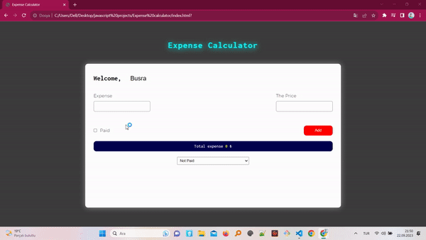

<h2>The name of the project </h2>

Javascript-Expense-Calculator

Expense Calculator is a user-friendly web application built with JavaScript, HTML, and CSS to help you track your expenses, manage your budget, and gain insights into your spending habits.

## Features

- **Add Expenses**: Easily record your daily expenses with descriptions and amounts.
- **View Expenses**: See a list of all your recorded expenses with timestamps.
- **Calculate Total Expenses**: Get the total sum of all your expenses.
- **Delete Expenses**: Remove individual expenses from your records.

## Demo

You can see a live demo of the Expense Calculator 

HERE! 

